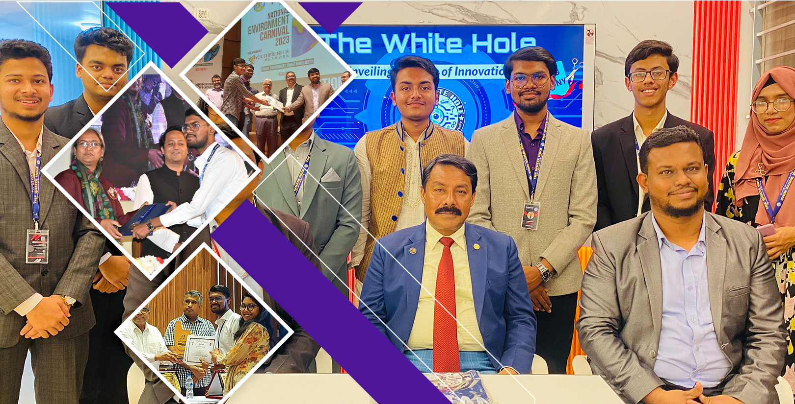

<html lang="zxx">
    <head>
        <meta charset="UTF-8">
        
        <meta http-equiv="X-UA-Compatible" content="IE=edge">
        <meta name="viewport" content="width=device-width, initial-scale=1.0">
        <title>The White Hole</title>
        <link rel="icon" href="logo.png" />
        <link rel="stylesheet" href="main.css">
        <meta name="viewport" content="width=device-width,initial-scale=1.0">
  <!-- font awesome -->
  
  <!-- default color skin -->
  <link rel="stylesheet" type="text/css" href="skins/color-1.css">
        <link href='https://unpkg.com/boxicons@2.1.4/css/boxicons.min.css' rel='stylesheet'>
    </head>
    <body>
        
            <!-- header start -->
  <header class="header">
      

                <!-- navigation menu start -->
        <nav>
            

              
&#9776;

              
&times;

                
                <ul style="font-weight: 800;">
                    <li><a href="#home">Home</a></li>
                    <li><a href="#join">Join Us</a></li>
                    <li><a href="#news">News</a></li>
                    <li><a href="#">Achievements</a></li>
                    <li><a href="#about">About</a></li>
                    <li><a href="#contact">Contact</a></li>
                </ul>
        </nav>
        <!-- navigation menu end -->
          
        

      

  </header>
  <!-- header end -->

  <!-- home section start -->
  <section class="home-section section active" id="home">
    

            
            

                <h1>Welcome to The White Hole!</h1>
                
– where innovation meets infinite possibilities! As a dynamic hub for creativity and collaboration, we propel into the realms of the unknown, exploring the uncharted territories of technology and beyond. Dive into a universe where ideas come to life, and discovery knows no bounds. Join us on a journey at the forefront of cutting-edge endeavors, where the ordinary transforms into the extraordinary. The White Hole: Igniting imagination, powering innovation.

            

               <a href="#about"><button type="button">About</button></a>
                <a href="#join"><button type="button">Join Us</button></a>
            

        

    

        </section>
    <!-- home section close -->

    <!-- Join us section start -->
  

    

            
            

                <h1>Join the Journey of   Innovation and Excellence!</h1>
                
– Embark on a thrilling adventure with us as we delve into the realms of robotics and technology. Our community is a vibrant hub where creativity knows no bounds, and passion fuels progress. Whether you're an aspiring enthusiast or a seasoned expert, there's a place for you in our dynamic club.  Explore the cutting edge of technology, engage with like-minded individuals, and be a part of something extraordinary. Together, we push boundaries, challenge norms, and build a future where innovation takes center stage. Ready to be a part of this exciting journey? Join us and let's create, innovate, and inspire together!

                <h2>🚀 Get Started:</h2>
            

               <a target="_blank" href="https://forms.gle/PwXyEcy6WeJzcgXD9"><button type="button-2">Committee Member</button></a>
                <a target="_blank" href="https://forms.gle/rRyNyKXyj8RuJKZW9"><button type="button-2">General Member</button></a>
            

        

    

    

    <!-- Join us section close -->

    
    <!--News  section start-->
    
    <!-- Post Filter -->
    

        
All

        
News

        
Tech

        
Electronics

        
Software

    

    <!-- Posts -->
    <section class="post container section" id="news">
        <!--Post Box-1-->
        

            
            <h2 class="category">News</h2>
            <a href="post-page-1.html" class="post-title">Unveiling a New Era of Innovation: "The White Hole" Robotics Club's Grand Opening</a>
            
16 February, 2024

            
In a momentous event that resonates with the spirit of innovation and collaboration, "The White Hole" Robotics Club officially marked its beginning with a grand opening ceremony on February 13, 2024. The ceremony, held at CDA Avenue, East Nasirabad, Chattogram, brought together an assembly of passionate individuals dedicated to the field of robotics.....

        

            
            <em class="profile-name">Tanvir Rahman</em>
        

        

        <!--Post Box-2-->
        

            
            <h2 class="category">Others</h2>
            <a href="about-page.html" class="post-title">Welcome to The White Hole Robotics Club!</a>
            
16 February, 2024

            
At The White Hole Robotics Club, we are more than just a community of technology enthusiasts; we are a dynamic collective driven by a passion for innovation and creativity. Our journey began with a simple yet powerful vision – to create a space where individuals, regardless of their experience level, could delve into the captivating world of robotics......
           
        

            
            <em class="profile-name">Tanvir Rahman</em>
        

        

        <!--Post Box-3-->
        

            
            <h2 class="category">Tech</h2>
            <a href="post-page-2.html" class="post-title">Unleashing Creativity: Introducing Sora - OpenAI's Text-to-Video Marvel</a>
            
18 February, 2024

            
In a groundbreaking leap forward, OpenAI introduces Sora, an AI model that transcends traditional boundaries by bringing text to life in the form of captivating and realistic videos. Sora, a diffusion model, represents a monumental advancement in the realm of artificial intelligence, combining the power of language understanding with visual synthesis.......

        

            
            <em class="profile-name">Tanvir Rahman</em>
        

        

    </section>
    <!--News  section close-->

    <!--About  section open-->
    

    

        <h1 class="about-header">About Us</h1>
        <h2 class="about-header">Empowering Tomorrow's Innovators</h2>
    

    

    

        

            

                
            

            

                
<b>Introduction:</b>
                    Welcome to The White Hole, a dynamic hub for robotics enthusiasts and tech aficionados. Since our establishment in [Year], we've been at the forefront of technological innovation, fostering a community driven by curiosity, creativity, and collaboration.   
                    
                    <b>Our Vision:</b>
                    At The White Hole, we envision a future where technology is a catalyst for positive change. Our vision is to empower individuals to harness the power of robotics and artificial intelligence for the betterment of society.  

                    

                        <a href="about-page.html"><button class="button-1">Read More</button></a>
                    

                    

        

    

    <!--About  section close-->
    <!-- contact section start -->
  

    

      

        

          <h2 data-heading="contact">Get In Touch</h2>
        

      

      

        <!-- contact item start -->
        

          

            <i class="fas fa-phone"></i>
            <h1>Phone</h1>
            
+880 1866 659407

          

        

        <!-- contact item end -->
         <!-- contact item start -->
         

          

            <i class="fas fa-envelope"></i>
            <h1>Email</h1>
            
twhinnovators@gmail.com

             

        

        <!-- contact item end -->
        <!-- contact item start -->
        

          

            <i class="fas fa-map-marker-alt"></i>
            <h1>Address</h1>
            
Lalkhan Bazar, Chattagram, Bangladesh.

          

        

        <!-- contact item end -->
      

      

        

          <form action="https://formsubmit.co/tanvirhalishahar934@gmail.com" method="POST">
            

              

                

                  <input type="text" name="Name=" placeholder="Name" class="input-control">
                

                

                  <input type="text" name="Email=" placeholder="Email" class="input-control">
                

                <input type="hidden" name="_next" value="https://iamtanvir.000webhostapp.com/">
                

                  <input type="text" name="Subject=" placeholder="Subject" class="input-control">
                

              

              

                

                  <textarea class="input-control" name="Message=" placeholder="Message">
                  </textarea>
                

              

            

            

              

                <button type="submit" class="button-1">Send Message</button>
              

            

          </form>
        

      

    

    <!-- visitor counter start -->
    

      

        <i class="fa fa-users" aria-hidden="true"></i>
        This page has
        
0

        
views

         

    

    <!-- visitor counter end -->

  <!-- contact section end -->

    
    
    </body>
</html>
